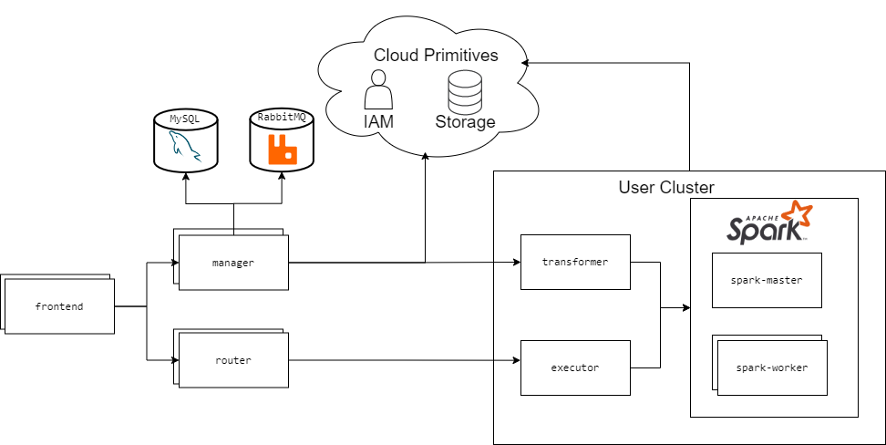

# Depot
Depot is an open-source collaborative data platform with the objective of facilitating cross-organizational
creation, distribution, and consumption of dynamic digital assets. 


## Architecture


## Installation
Depot's artifacts are packaged as Docker images. 
We use [sbt](https://www.scala-sbt.org/) to manage our builds and package JVM applications.
Additionally, we use [yarn](https://yarnpkg.com/) to bundle and package static frontend assets.
### Requirements
* [Java 14](https://openjdk.java.net/install/)
* [sbt](https://www.scala-sbt.org/1.x/docs/Setup.html)
* [yarn](https://classic.yarnpkg.com/en/docs/install)
* [Docker](https://docs.docker.com/get-docker/)

### Docker Images
1. Clone this repository
```shell script
git clone https://github.com/MAYHEM-Lab/Depot
```
2. Navigate to repository
```shell script
cd Depot
```
3. Build images via sbt
```shell script
sbt docker
```
The resulting images will be made available in the local Docker image repostiory with the prefix `racelab/depot-`.

## Deployment
Depot integrates tightly with a Eucalyptus cloud environment to manage storage and access control policies and as such requires administrative access to a Eucalyptus deployment. It does not yet support running on other cloud providers or baremetal out-of-the-box.

Depot uses GitHub OAuth for identity management and requires credentials to an existing GitHub OAuth application.

### Setup
These instructions outline running a non-highly-available, barebones, Depot deployment in Eucalyptus, facilitated by Kubernetes.
They are for Ubuntu 20.04 hosts running a Linux kernel version of at least 5.4.

#### Requirements
* [euca2ools](https://github.com/eucalyptus/euca2ools) - [setup](https://sites.cs.ucsb.edu/~rich/class/cs270/projects/eucalyptus-fuse.html)
* [kubectl](https://kubernetes.io/docs/tasks/tools/)

#### Eucalyptus Setup
1. Open ports required by Depot and Kubernetes
```shell script
euca-authorize default -p 80
euca-authorize default -p 443
euca-authorize default -p 6443
euca-authorize default -p 30080
```
2. Create load balancer
```shell script
eulb-create-lb -l "lb-port=80, protocol=HTTP, instance-port=30080, instance-protocol=HTTP" -z <ZONE> depot-frontend
```
2. Provision Ubuntu 20.04 VMs. This example provisions 6 instances.
```shell script
euca-run-instances emi-0222560f -t m1.large -n 6 -k <key-pair>
```
3. Wait until all instances are reported as `running` via `euca-describe-instances`
4. Select one instance for MySQL, one instance for RabbitMQ, and the rest to form the Kubernetes cluster. These instances can be named with a user-friendly name for convenience:
```shell script
euca-create-tags <instance1> --tag Name=depot-mysql
```
5. Register Kubernetes instances with frontend load balancer
```shell script
eulb-register-instances-with-lb --instances <k8s-instance1>,<k8s-instance2>,... depot-frontend
```

### MySQL
1. Connect to the instance selected as the MySQL host
```shell script
ssh ubuntu@<instance-public-ip>
```
2. Clone this repository
```shell script
git clone https://github.com/MAYHEM-Lab/Depot
```
3. Run the MySQL installation script as root.
```shell script
sudo ./deploy/platform/mysql/install.sh
```
4. Keep track of the MySQL credentials output at the end.


### RabbitMQ
1. Connect to the instance selected as the RabbitMQ host
```shell script
ssh ubuntu@<instance-public-ip>
```
2. Clone this repository
```shell script
git clone https://github.com/MAYHEM-Lab/Depot
```
3. Run the RabbitMQ installation script as root.
```shell script
sudo ./deploy/platform/rabbitmq/install.sh
```
4. Keep track of the RabbitMQ credentials output at the end.

#### Kubernetes
##### Common
1. SSH into each instance selected as a Kubernetes host
```shell script
ssh ubuntu@<instance-public-ip>
```
2. Clone this repository
```shell script
git clone https://github.com/MAYHEM-Lab/Depot
```
3. Run the Kubernetes common installation script
```shell script
sudo ./deploy/platform/k8s/common.sh
```

From the instances selected as Kubernetes hosts, select one to serve as the cluster's master node.
##### Master
1. SSH into the instance selected as the Kubernetes master
```shell script
ssh ubuntu@<master-instance-public-ip>
```
2. Clone this repository
```shell script
git clone https://github.com/MAYHEM-Lab/Depot
```
3. Run the Kubernetes master installation script
```shell script
sudo ./deploy/platform/k8s/master.sh
```
4. Save the generated output command resulting from installation script invocation
5. Change owner of Kubernetes credential file to `ubuntu`:
```shell script
chown ubuntu:ubuntu /etc/kubernetes/admin.conf
```
6. On local machine (SSH client), copy the Kubernetes credentials over to authorize `kubectl`:
```shell script
mkdir -p ~/.kube
scp ubuntu@<master-instance-public-ip>:/etc/kubernetes/admin.conf ~/.kube/config
```

##### Worker
1. SSH into the instance selected as the Kubernetes master
```shell script
ssh ubuntu@<master-instance-public-ip>
```
2. Run the generated command from installation of Kubernetes master
```shell script
echo "...." >> /etc/hosts && kubeadm join ...
```

### Services
In addition to the MySQL and RabbitMQ credentials from the aforementioned steps, you will need your Github OAuth App credentials and Eucalyptus access keys to configure and deploy the services.

1. Generate the Depot access key. Store this securely somewhere - it is used to interact with the Depot REST API in an administrative manner.
```shell script
access_key=$(tr -dc A-Za-z0-9 </dev/urandom | head -c 13 ; echo '')
```
2. Generate the Depot JWT key. This will be used to sign user tokens. Do not save or distribute this.
```shell script
jwt_secret=$(tr -dc A-Za-z0-9 </dev/urandom | head -c 13 ; echo '')
```
3. Create Kubernetes secrets
```shell script
kubectl create secret generic mysql-credentials \ 
  --from-literal=host="$mysql_host" \
  --from-literal=username="$mysql_username" \
  --from-literal=password="$mysql_password"

kubectl create secret generic rabbitmq-credentials \
  --from-literal=host="$rabbitmq_host" \
  --from-literal=username="$rabbitmq_username" \
  --from-literal=password="$rabbitmq_password"

kubectl create secret generic github-credentials \
  --from-literal=client_id="$github_client_id" \
  --from-literal=client_secret="$github_client_secret"

kubectl create secret generic auth-keys \
  --from-literal=jwt_secret="$jwt_secret" \
  --from-literal=access_key="$access_key"

kubectl create secret generic cloud-credentials \
  --from-literal=access_key="$cloud_access_key" \
  --from-literal=secret_key="$cloud_secret_key"
```
4. Create Kubernetes deployments and services
```shell script
kubectl apply -f deploy/system/manager.yaml
kubectl apply -f deploy/system/notebook-router.yaml
kubectl apply -f deploy/system/frontend.yaml
```
5. After the Eucalyptus load balancer registers and discovers the frontend service, the Depot platform should be available at the load balancer's DNS name. This process may take a few minutes.

### User Clusters
Clusters used by users and organizations to dispatch transformations and execute notebooks are deployed as self-contained Kubernetes namespaces.

#### Creation
User clusters are managed with Depot's `clusterctl` tool.
1. Identify Depot endpoint and admin access key. If the steps above were followed, the endpoint is the DNS name of the Eucalyptus load balancer and the access key should have been securely stored.
2. Identify entity name for which the cluster should be created (username or organization name)
3. Create cluster
```shell script
./deploy/cluster/clusterctl -k <key> -s <endpoint> create <entity> <cluster-name>
```
4. The created cluster's Spark capacity can be managed by modifying the `spark-worker` deployment in the cluster's namespace.
